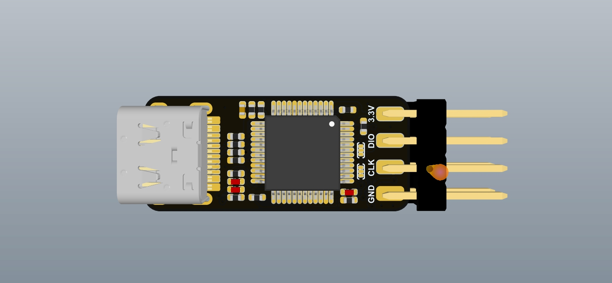
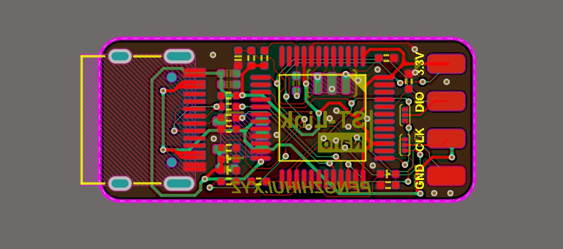
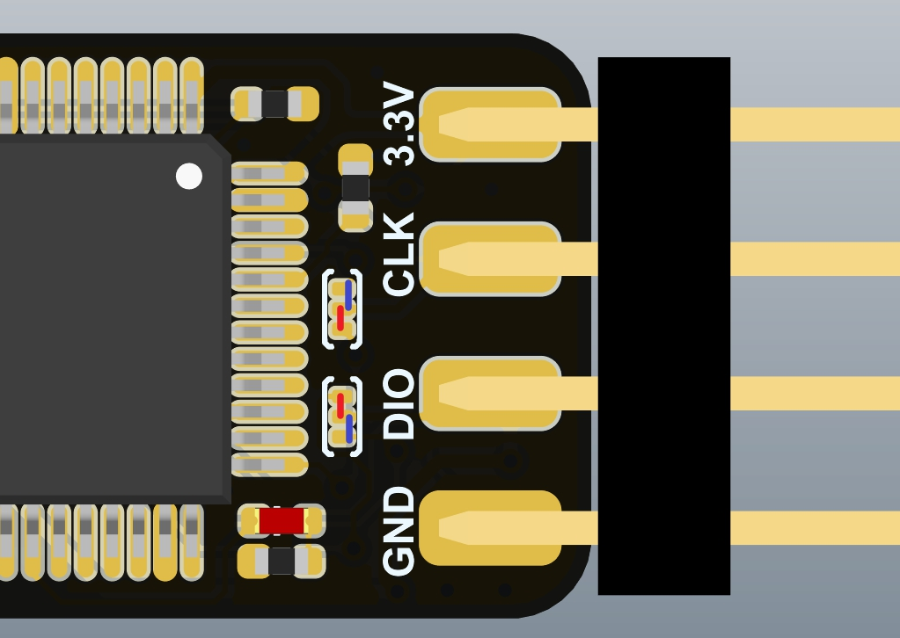
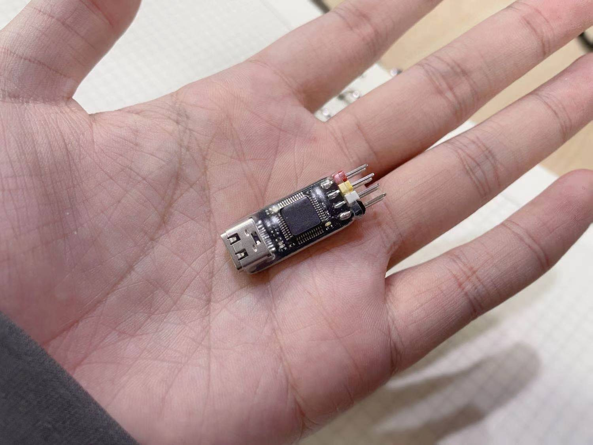

# ST-Link-Nano
> 自制超迷你的ST-Link模块。

跟我之前做的DAPLink基本一致，基于ST-Link V2版本硬件修改而成。没有什么特殊的功能，就是个人使用Clion做STM32开发时，OpenOCD对于ST-Link的支持比DAPLink要好（兼容的芯片型号、下载速度），所以额外又设计了一个下载器。

下载器芯片用的是STM32F103CBT6，带一个虚拟串口功能，可以同时作为ST-Link和USB转串口模块使用，同时带一个U盘下载固件功能。

## 使用方法

板子上有两个跳线焊盘，分别连接到STM32F103的SWD引脚，以及作为ST-Link时的SWD引脚。所以在焊好之后，先跳线选择到`STM32F103`的SWD引脚，给STM32下载仓库的Bootloader固件（用`STLink-Utility`等软件）；之后用`ST-LinkUpgrade`软件升级即可，可选择（stm32 debug + VCP + MSD）；然后再把跳线跳到另外一边，就可以正常当ST-Link用了。

## 跳线说明

* 先按红色的连线跳线，用另一个J-Link或者ST-Link给本板子下载BootLoader
* 然后跳到蓝色的跳线（保持本板子的USB和电脑的连接），用`ST-LinkUpgrade`软件升级固件
* 重新上电即可正常使用（没装驱动的话可以装一下仓库提供的官方驱动），可以在设备管理器看到ST-Link设备和一个COM口

> 焊接好的实物照片，硬件功能已验证没有问题👇

### Enjoy~记得给仓库点星星